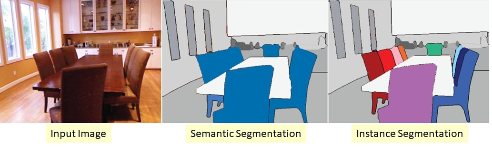

Semantic Segmentation and Pixel Labelling

*Semantics* is a sysnonym for meaning, and *segmentation* is division of a whole into parts. Clustering pixels into meaningful groups is semantic segmentation. Applied to Computer Vision, it can be related to by both - images (2D) and point clouds (3D).  
In an image, there could be many object classes (like car, bike, person, dog, so on). When we cluster a group of pixels and label them all as a particular class, the image is said to have been segmented on the basis of semantics set up as the object classes. Pixels are categorized on the basis of their contents [RGB values].  
  
- Label each pixel with what category it is..[look at cow image]
- Different from detection?-- Detection labels boxes, segmentation labels pixels.
- Segmentation tells us that therese are cows
- Instance seg tells us how many cows in scene
- Another problem: foreground/background segmentation
- Similar to semantic segmentation, exept classes are only 2 - fore and back ground
- Next problem: Amodal Segmentation
    ○ Want to predict beyound occlusion as well
    ○ That is if obkect was projected, all pixels are highloghted irrespective of occlusion
- Turning a detector into a mediocre segmentaion algorithm
    ○ All pixels in a detected bbox belong to a class object -- thus mediocre
- Pose Prediction
    ○ Segmenting k different parts of human body
- 3D Depth Prediction
    ○ Depth is continous -- each pixel labelled with depth value
- Datasets:
    ○ Pascal VOC
        § 20 cks
        § Soarse coverage -- rest of world black -- most pixels balck
    ○ MS COCO
        § Instances labelled + 91 cls
        § Sparse coverage
    ○ NYU v2 - mostly indoor
        § 40 cls
        § Dense coverage -- almost all pixels labelled (80-90%)
        § Depth information additionally provided 
- Evaluation
    ○ Pixel acc
        § If predicted pixel is horse and gt pixel is also horse, then 1
        § Otherwise 0
        § If you do good on long tailed classes, object accuracy doesn't matter
    ○ Class acc
        § % correct pixels averaged per class
        § Class tree
            □ 3 diff segmentation - a, b, c
            □ 3-4% increase not necessary
    ○ Intersection over Union (IOU)
        § Can get majority of pixels right would give a higher IOU but it might be missing out on essential pixels -- ex. Cow -- torso labelled, about 0.7 IOU but missing out on legs.
- Pipeline
    ○ Image --> Pixel labels
    ○ Modelling appearance for each class -- how does a cow pixel look like
    ○ Pixel labels in neighbourhood must not change drastically -- one cow pixel, two cow pixel, next cannot be deer pixel even though color matches
    ○ CRF
        § Optimized over laelling of nodes y
        § Look at slie for energies
        § Pairwise terms
            □ Do pixels yi and yj have similarilty>
            □ If pixels labelled similarly, and line connecting these pixels does not cross any boundary, then the labels should be same
        § NP hard to optimize
        § Group pixels intoo superpixel
        § Ssuperpiel has only one label
        § Insteead of graph being 1000 by 1000, just have to label 800 super pixels
        § Assuing label of each pxel only depemds on neighbourhood
        § Fully connected CRFs
    ○ SOTA:
        § Making a fully connected layer into a fully conv layer
        § Look at slide
        § As we reuce to a smaller and and smaller dim, our receptive field is constantly increaseing and thus can classify in that reduced dim
        § Upsampling the low dim into HxW
            □ How to do upsampling from feature maps
            □ Bilinear interpolation
            □ Unpooling -- cv2.pyrUp
            □ Devoncolution layer -- inverse of convolution
                ® Convolution - 
                    ◊ 4x4 -> 2x2 from learned 3x3 filter -- look at slides
                ® Deconv
                    ◊ SEPARATELY Learn 3x3 filters that takes a 2x2 to 4x4
                    ◊ For overlapping areas, sum the responses
                    ◊ Wait -- this is transpose convolution; deconvolution is something different
                    ◊ Very similar to Bilinear interpolation except that Bilinear Interpolation has fixed weights, but we need to learn weights in this case.
            □ Bike example -- blob segmented because the conv layers keep on reducing the input into blobs and thus deconv (as it works on the smaller pixel cluseterd from the receptive field) also highlights larger blob.
        § How to avoid this blobbing?
            □ Use last layer features with middle layers as well.
            □ Skip Layers
                ® 225->55->13->add to feat map|------>makes feat size bigger so that edge info retained & blob like behavior reduces
                ®             --------->add to feat map|------> same
                ® Look at slides
            □ Look at feedback based detection
            □ SOTA is feedforward nets because feedback is very difficult
            □ Hypercolumns
                ® Learn classifcier for each pxel
                ® Build feature maps for each pixel
                ® Concat all layer features for pixel pi
                    ◊ Classifier predicts if this hypercolumn of feats corresp to pi is a horse, cat, so on
                    ◊ Should we learn same classifier or different classifier
                        } Same feats have diff meaning based on sparial occurance in the image
                        } Learning one classif per pixel means learing HxW classifs
                            –  Computationally intensive
                            – Alsp non generalizable
                        } Thus image broken into 5x5 grids
                        } Learn these 25 classifs.
                    ◊ Problem:
                        } 55,55,96 -> 227,227,96
                        } Lots of channels (96) ==> Computationally intensive
                        } Upsampling linear,
                        } Classifs linear
                        } Thus can switch order and output still reamins same
                        } Thus instead of classif first,
                        } Conv, upsample, classifier interpolation
            □ MaskRCNN
                ® Feats extracted from ROI pooling is being used to segment a mask
                ® Mask learnt end to end
                ® During ROI pooling, clipping out the boundaryies
                ® Don’t do the sanping, do an interpolation to get the features.
                ® No qinatizatio instead use bilinear interpolation
                ® Important because segmentation cares about boundaries; detection, classification does not.
                ® Using another head for seg, improves preformance on detecetion as well -- remember from the deep learning class, something about adding more tasks improves the accuracy overall ?? Refer to those notes as well and write it all up! :)
-------------------------------------------------------------------------------------------------------------------------------------------------------------------------------------------------------------
    
